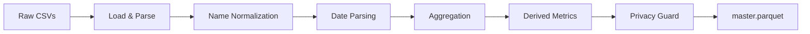
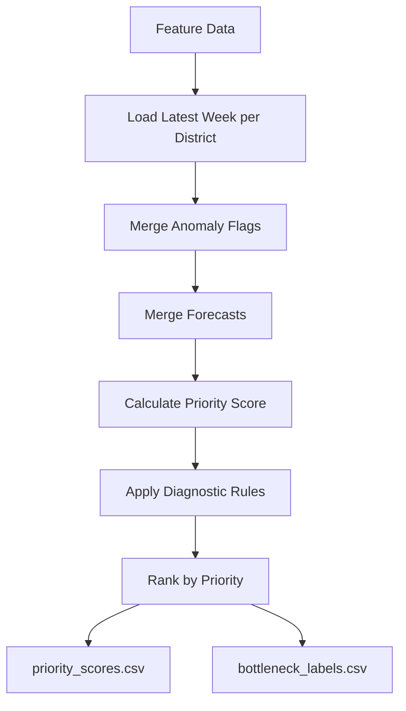

# Aadhaar Pulse: Comprehensive Methodology Document

**Child Update Intelligence Platform**  
*A Complete Technical Reference for Data Science and Policy Decision Support*

---

## Table of Contents

1. [Executive Summary](#executive-summary)
2. [Problem Definition](#problem-definition)
3. [Data Architecture](#data-architecture)
4. [ETL Pipeline](#etl-pipeline)
5. [Privacy Framework](#privacy-framework)
6. [Feature Engineering](#feature-engineering)
7. [Demand Forecasting](#demand-forecasting)
8. [Anomaly Detection](#anomaly-detection)
9. [Bottleneck Fusion Engine](#bottleneck-fusion-engine)
10. [Policy Simulation](#policy-simulation)
11. [Fairness & Equity Analysis](#fairness--equity-analysis)
12. [AI Chatbot Integration](#ai-chatbot-integration)
13. [System Architecture](#system-architecture)
14. [Testing & Validation](#testing--validation)
15. [Appendix: Configuration Reference](#appendix-configuration-reference)

---

## Executive Summary

Aadhaar Pulse is an end-to-end intelligence platform designed to help UIDAI and state agencies prioritize and optimize child biometric update operations across India's 1,100+ districts. The platform implements a **fusion-based diagnostic approach** that combines:

- **Demand Forecasting** using LightGBM with hierarchical reconciliation
- **Anomaly Detection** via Isolation Forest and Seasonal Hybrid ESD
- **5-Type Bottleneck Classification** using rule-based fusion
- **Monte Carlo Policy Simulation** with 90% confidence intervals
- **Privacy-First Architecture** with k-anonymity (k=10) and SHA-256 hashing
- **AI-Powered Chatbot** using Google Gemini 2.5 Flash for natural language queries

### Key Technical Achievements

| Component | Metric | Target |
|-----------|--------|--------|
| Demand Forecasting | SMAPE | <70% |
| K-Anonymity | Threshold | k=10 |
| Anomaly Detection | Contamination | 5% |
| Monte Carlo Runs | Per Scenario | 1,000 |
| Dashboard Tabs | Interactive Views | 8 |
| Test Coverage | Automated Tests | 77 |

---

## Problem Definition

### Business Context

India's Unique Identification Authority (UIDAI) manages Aadhaar biometric updates for over **150 million children aged 5-15**. These mandatory updates are critical for children to maintain access to government benefits including:

- Mid-day meal programs
- Direct benefit transfers
- Scholarship disbursements
- Healthcare subsidies

### Current Pain Points

| Pain Point | Description |
|------------|-------------|
| **Reactive Operations** | Districts address backlogs only after crisis levels |
| **No Demand Visibility** | Limited ability to forecast upcoming surge periods |
| **Resource Misallocation** | Interventions deployed without data-driven prioritization |
| **Exclusion Risk** | Children with outdated biometrics face authentication failures |
| **Information Silos** | Enrollment, demographic, and biometric data analyzed separately |

### Solution: Fusion-Based Diagnostic Intelligence

The platform uses a closed-loop intelligence system:

```
┌─────────────────┐
│   Data Sources  │
│  (3 streams)    │
└────────┬────────┘
         │
┌────────▼────────┐
│  ETL Pipeline   │
│  + Privacy      │
└────────┬────────┘
         │
┌────────▼────────┐
│    Feature      │
│  Engineering    │
└────────┬────────┘
         │
    ┌────┴────┬────────────┐
    ▼         ▼            ▼
┌───────┐ ┌───────┐ ┌──────────┐
│Forecast│ │Anomaly│ │Bottleneck│
│LightGBM│ │Detect │ │  Rules   │
└───┬───┘ └───┬───┘ └────┬─────┘
    └─────────┼──────────┘
              ▼
    ┌─────────────────┐
    │  Fusion Engine  │
    │  (5 diagnoses)  │
    └────────┬────────┘
             │
     ┌───────┼───────┐
     ▼       ▼       ▼
┌────────┐┌────────┐┌────────┐
│Priority││Simulator││Dashboard│
│Ranking ││Monte   ││& API   │
│        ││Carlo   ││        │
└────────┘└────────┘└────────┘
```

---

## Data Architecture

### Data Sources

The platform ingests three primary data streams at weekly granularity:

| Dataset | Frequency | Key Fields | Purpose |
|---------|-----------|------------|---------|
| **Enrolment** | Weekly | date, state, district, pincode, age_0_5, age_5_17, age_18_greater | New Aadhaar registrations |
| **Demographic Updates** | Weekly | date, state, district, pincode, demo_age_5_17, demo_age_17_ | Address/name changes |
| **Biometric Updates** | Weekly | date, state, district, pincode, bio_age_5_17, bio_age_17_ | Fingerprint/iris updates |

### Canonical Schema

After ETL processing, data is stored in `master.parquet` with the following schema:

| Column | Type | Description |
|--------|------|-------------|
| `state` | string | Indian state name (normalized) |
| `district` | string | District name (normalized) |
| `year` | int | ISO calendar year |
| `week_number` | int | ISO week number (1-52) |
| `enroll_child` | int | Child enrolments (age 5-17) |
| `enroll_total` | int | Total enrolments (all ages) |
| `demo_update_child` | int | Child demographic updates |
| `demo_update_total` | int | Total demographic updates |
| `bio_update_child` | int | Child biometric updates |
| `bio_update_total` | int | Total biometric updates |
| `bio_demo_ratio_child` | float | bio_update / demo_update ratio |
| `bio_demo_gap_child` | int | demo_update - bio_update (backlog proxy) |
| `saturation_proxy` | float | enroll_child / enroll_total |

### Data Quality Observations

1. Age groups don't perfectly align (enrollment has 0-5, others use 5-17)
2. Age 5-17 is used as proxy for target age 5-15
3. All counts are pre-aggregated — no PII is ingested
4. Merge key: `(date, state, district, pincode)` → aggregated to `(state, district, year, week_number)`

---

## ETL Pipeline

**Source:** [`src/agg_etl.py`](file:///d:/Coding/UIDAI/code/src/agg_etl.py)

### Pipeline Stages



### Stage 1: Load Raw Data

Files are loaded using glob patterns:
- `*enrolment*.csv`
- `*demographic*.csv`
- `*biometric*.csv`

### Stage 2: District Name Normalization

Historical name changes in India require normalization:

| Old Name | Normalized Name |
|----------|-----------------|
| Bangalore Urban | Bengaluru Urban |
| Mysore | Mysuru |
| Mangalore | Mangaluru |
| Bombay | Mumbai |
| Calcutta | Kolkata |
| Madras | Chennai |
| Trivandrum | Thiruvananthapuram |

### Stage 3: Date Parsing

Dates are parsed from DD-MM-YYYY format and decomposed:
```python
df['date'] = pd.to_datetime(df['date'], format='%d-%m-%Y')
df['year'] = df['date'].dt.isocalendar().year
df['week_number'] = df['date'].dt.isocalendar().week
```

### Stage 4: Aggregation

Data is aggregated to **state-district-week** grain:
```python
keys = ['state', 'district', 'year', 'week_number']
master = enrol_agg.merge(demo_agg, on=keys, how='outer')
         .merge(bio_agg, on=keys, how='outer')
```

### Stage 5: Derived Metrics

```python
# Bio/Demo ratio for children
df['bio_demo_ratio_child'] = df['bio_update_child'] / df['demo_update_child']

# Gap metric (backlog proxy)
df['bio_demo_gap_child'] = df['demo_update_child'] - df['bio_update_child']

# Saturation proxy (child proportion)
df['saturation_proxy'] = df['enroll_child'] / df['enroll_total']
```

---

## Privacy Framework

**Source:** [`src/privacy_guard.py`](file:///d:/Coding/UIDAI/code/src/privacy_guard.py)

The platform implements a multi-layered privacy protection approach aligned with government data handling requirements.

### K-Anonymity Enforcement

**Threshold:** k=10 (all counts below 10 are suppressed)

```python
def apply_k_anonymity(df, k=10, count_columns=None):
    """
    Suppress counts below threshold with audit logging.
    Suppressed values are replaced with -1 marker.
    """
    for col in count_columns:
        mask = (df[col] > 0) & (df[col] < k)
        if mask.any():
            # Log suppression for audit trail
            # Replace with -1 (suppression marker)
            df.loc[mask, col] = -1
```

### Cryptographic Hashing

**Algorithm:** SHA-256 with configurable salt

```python
def hash_identifier(raw_id: str, salt: str = None) -> str:
    """
    Hash identifier using SHA-256 with salt.
    Salt priority: Streamlit secrets > Env variable > Default
    """
    combined = f"{salt}:{raw_id}"
    return hashlib.sha256(combined.encode('utf-8')).hexdigest()
```

### Audit Trail

All suppressions are logged with:
- Timestamp
- State/District
- Year/Week
- Column name
- Original count
- Action taken

**Log path:** `data/inventory/suppression_log.csv`

### Differential Privacy (Exports)

**Source:** [`src/dp_export.py`](file:///d:/Coding/UIDAI/code/src/dp_export.py)

For external data sharing, differential privacy is applied:
- **Mechanism:** Laplace/Gaussian noise
- **Privacy budget:** ε=1.0 (default)
- **Rate awareness:** Different noise calibration for count vs. rate columns

---

## Feature Engineering

**Source:** [`src/features.py`](file:///d:/Coding/UIDAI/code/src/features.py)

### Temporal Features

| Feature | Formula | Purpose |
|---------|---------|---------|
| `lag_1w_bio_update_child` | shift(1) | Previous week's bio updates |
| `lag_2w_bio_update_child` | shift(2) | 2 weeks ago bio updates |
| `rolling_4w_mean_bio_update_child` | rolling(4).mean() | 4-week moving average |
| `wow_change_bio_update_child` | current - lag_1w | Week-over-week delta |
| `trend_bio_update_child` | sign(wow_change) | Trend direction (+1/0/-1) |

### Performance Features

| Feature | Formula | Purpose |
|---------|---------|---------|
| `failure_rate_child` | 1 - (bio_update / bio_attempts) | Biometric failure rate |
| `update_backlog_child` | demo_update - bio_update | Pending updates gap |
| `completion_rate_child` | bio_update / demo_update | Update completion ratio |
| `saturation_proxy` | enroll_child / enroll_total | Child proportion indicator |
| `child_focus_ratio` | bio_update_child / bio_update_total | Child service focus |
| `backlog_severity` | normalized backlog | Relative backlog intensity |

### Priority Score Calculation

```python
def add_priority_score(df):
    """
    Composite priority score for intervention ranking.
    Higher score = higher priority for intervention.
    """
    # Weights
    w_backlog = 0.4
    w_incompletion = 0.3
    w_volume = 0.3
    
    priority_score = (
        w_backlog * minmax_scale(update_backlog_child) +
        w_incompletion * (1 - completion_rate_child) +
        w_volume * minmax_scale(enroll_child)
    )
```

---

## Demand Forecasting

**Source:** [`src/forecast_lightgbm.py`](file:///d:/Coding/UIDAI/code/src/forecast_lightgbm.py)

### Model Architecture

**Algorithm:** LightGBM (Gradient Boosting Decision Tree)

```python
params = {
    'objective': 'regression',
    'metric': 'mape',
    'boosting_type': 'gbdt',
    'num_leaves': 31,
    'learning_rate': 0.05,
    'feature_fraction': 0.8,
    'bagging_fraction': 0.8,
    'bagging_freq': 5,
    'num_boost_round': 200
}
```

### Feature Set

| Category | Features |
|----------|----------|
| **Categorical** | state_encoded, district_encoded |
| **Calendar** | week_number, month, quarter, week_sin, week_cos, is_school_break |
| **Lags** | lag_1w_bio, lag_2w_bio, lag_3w_bio, lag_4w_bio, lag_1w_demo, lag_2w_demo |
| **Rolling** | rolling_4w_bio_mean, rolling_8w_bio_mean, rolling_12w_bio_mean, rolling_4w_bio_std |
| **Trend** | bio_trend_4w (lag_1w - lag_4w) |
| **Hierarchical** | state_bio_update, district_share_bio, district_share_enroll |
| **Cross-Stream** | enroll_child, demo_update_child, saturation_proxy |

### Time-Series Cross-Validation

**Method:** Expanding window (4 folds)

```python
def time_series_cv(X, y, df_meta, n_folds=4):
    """
    Expanding window time-series cross-validation.
    
    Fold 1: Train on weeks 1-N, validate on N+1 to 2N
    Fold 2: Train on weeks 1-2N, validate on 2N+1 to 3N
    ...
    """
```

### Calendar Features

```python
# Cyclical encoding for week (captures seasonality)
df['week_sin'] = np.sin(2 * np.pi * df['week_number'] / 52)
df['week_cos'] = np.cos(2 * np.pi * df['week_number'] / 52)

# School break periods (demand surges)
school_break_weeks = list(range(18, 26)) +  # May-June
                     list(range(40, 45)) +  # Oct-Nov
                     list(range(49, 53))    # December
df['is_school_break'] = df['week_number'].isin(school_break_weeks)
```

### Hierarchical Reconciliation

**Source:** [`src/hierarchical_reconciliation.py`](file:///d:/Coding/UIDAI/code/src/hierarchical_reconciliation.py)

Ensures district forecasts aggregate to state totals using top-down reconciliation.

### Model Outputs

| Output | Description |
|--------|-------------|
| `yhat` | Point forecast |
| `yhat_lower` | Lower confidence bound (5th percentile) |
| `yhat_upper` | Upper confidence bound (95th percentile) |
| `forecast_week` | Target prediction week |

---

## Anomaly Detection

**Source:** [`src/anomaly_detection.py`](file:///d:/Coding/UIDAI/code/src/anomaly_detection.py)

### Dual-Method Approach

The platform uses two complementary anomaly detection methods:

#### 1. Isolation Forest (Multi-dimensional)

**Purpose:** Detect unusual combinations of features across the entire district-week space.

```python
def isolation_forest_anomalies(df, feature_cols, contamination=0.05):
    """
    Isolation Forest for multi-dimensional anomalies.
    
    Parameters:
    - contamination: Expected proportion of anomalies (5%)
    - n_estimators: 100 trees
    - random_state: 42 (reproducibility)
    """
    iso_forest = IsolationForest(
        contamination=contamination,
        random_state=42,
        n_estimators=100
    )
    
    predictions = iso_forest.fit_predict(X_scaled)  # -1 = anomaly
    scores = iso_forest.decision_function(X_scaled)
```

**Features used:**
- bio_update_child
- demo_update_child
- enroll_child
- update_backlog_child
- completion_rate_child

#### 2. Seasonal Hybrid ESD (Time-series)

**Purpose:** Detect temporal anomalies in individual district time series.

```python
def seasonal_esd_anomalies(df, value_col, max_anomalies=5, alpha=0.05):
    """
    Seasonal Hybrid ESD test using:
    1. Seasonal decomposition (period=4 weeks)
    2. Generalized ESD on residuals
    3. Modified Z-score threshold = 3.5
    """
    decomposition = seasonal_decompose(values, model='additive', period=4)
    residuals = decomposition.resid
    
    # Modified Z-score
    median = residuals.median()
    mad = np.median(np.abs(residuals - median))
    modified_z = 0.6745 * (residuals - median) / mad
    
    anomaly_idx = residuals.index[np.abs(modified_z) > 3.5]
```

### Combined Anomaly Flag

```python
df['combined_anomaly'] = (
    (df['is_anomaly'] == 1) |              # Isolation Forest
    (df['shesd_bio_anomaly'] == 1) |       # S-H-ESD on bio updates
    (df['shesd_demo_anomaly'] == 1)        # S-H-ESD on demo updates
)
```

---

## Bottleneck Fusion Engine

**Source:** [`src/bottleneck_fusion.py`](file:///d:/Coding/UIDAI/code/src/bottleneck_fusion.py)

### Five Diagnostic Categories

| Type | Key Triggers | Typical Cause | Recommended Action |
|------|--------------|---------------|-------------------|
| **OPERATIONAL_BOTTLENECK** | Low completion rate (<70%), high backlog, low bio/demo ratio (<0.6) | Hardware/process failures | Device upgrade, staff training |
| **DEMOGRAPHIC_SURGE** | Demand >50% above 4-week average, healthy completion rate (>80%) | Population growth, seasonal patterns | Mobile camps, extended hours |
| **CAPACITY_STRAIN** | High saturation (>50%), declining week-over-week trend | Infrastructure at limits | Device upgrade, new centers |
| **INCLUSION_GAP** | Low saturation (<30%), very low activity (<50), low completion (<50%) | Access barriers, awareness gaps | Awareness campaigns, mobile camps |
| **ANOMALY_DETECTED** | Isolation Forest or S-H-ESD flags | Unusual patterns requiring investigation | Manual review |

### Diagnostic Rules Implementation

```python
def flag_operational_bottleneck(row):
    """
    Triggers:
    - High failure rate or low completion rate (<70%)
    - Significant backlog (>50% of bio updates)
    - Low bio/demo ratio (<0.6)
    
    Returns: (is_triggered, label, rationale)
    """
    rationale = []
    
    completion_rate = row.get('completion_rate_child', 1)
    if pd.notna(completion_rate) and completion_rate < 0.7:
        rationale.append(f"Low completion rate ({completion_rate:.2f})")
    
    # ... additional checks
    
    if len(rationale) >= 2:
        return True, "OPERATIONAL_BOTTLENECK", "; ".join(rationale)
    return False, None, None
```

### Priority Score Formula

```python
def calculate_priority_score(row, forecasted_demand, w_demand=0.3, 
                              w_incompletion=0.3, w_backlog=0.25, w_inequity=0.15):
    """
    Composite priority score combining four components:
    
    Priority = w_demand × norm_demand + 
               w_incompletion × (1 - completion_rate) +
               w_backlog × norm_backlog +
               w_inequity × inequity_multiplier
    
    Where:
    - norm_demand: min(demand / 1000, 1)
    - norm_backlog: min(backlog / 500, 1)  
    - inequity: 1 - saturation_proxy (lower saturation = potential underserved)
    """
```

| Weight Component | Weight | Purpose |
|------------------|--------|---------|
| Demand | 0.30 | Higher demand = more children need service |
| Incompletion | 0.30 | Lower completion = backlog building |
| Backlog | 0.25 | Existing unprocessed updates |
| Inequity | 0.15 | Underserved areas get priority boost |

### Fusion Pipeline



---

## Policy Simulation

**Source:** [`src/simulator.py`](file:///d:/Coding/UIDAI/code/src/simulator.py)

### Intervention Configuration

Interventions are defined in [`config/interventions.json`](file:///d:/Coding/UIDAI/code/config/interventions.json):

| Intervention | Cost (₹) | Capacity/Week | Duration | Use Case |
|--------------|----------|---------------|----------|----------|
| Mobile Camp | 150,000 | 1,000 | 4 weeks | Remote areas, surge demand |
| Device Upgrade | 250,000 | 2,000 | 52 weeks | Hardware bottlenecks |
| Staff Training | 75,000 | 500 | 8 weeks | Skill gaps, high failure rates |
| Awareness Campaign | 50,000 | 300 | 6 weeks | Low enrollment, inclusion gaps |
| Extended Hours | 100,000 | 800 | 12 weeks | Capacity strain |

### Monte Carlo Simulation

**Purpose:** Propagate forecast uncertainty into intervention impact estimates.

```python
def run_monte_carlo_simulation(district_data, intervention, n_runs=1000):
    """
    Monte Carlo simulation with:
    - Demand sampled from uniform(forecast_lower, forecast_upper)
    - Effectiveness scenario sampled: conservative (25%), median (50%), optimistic (25%)
    - 90% confidence intervals (p5, p50, p95)
    """
    for _ in range(n_runs):
        sampled_demand = np.random.uniform(lower, upper)
        scenario = np.random.choice(
            ['conservative', 'median', 'optimistic'], 
            p=[0.25, 0.5, 0.25]
        )
        result = simulate_intervention(district_data, intervention, scenario)
        results.append(result)
    
    return {
        'backlog_reduction': {'p5': ..., 'p50': ..., 'p95': ...},
        'reduction_pct': {'p5': ..., 'p50': ..., 'p95': ...},
        'cost_per_update': {'p5': ..., 'p50': ..., 'p95': ...}
    }
```

### Simulation Model

Week-by-week simulation of intervention impact:

```python
def simulate_intervention(district_data, intervention, scenario='median'):
    """
    Simulates week-by-week impact:
    
    For each week:
        backlog += weekly_demand  # New demand adds
        total_capacity = baseline_capacity + (capacity_boost × effectiveness)
        processed = min(total_capacity, backlog)
        backlog -= processed
    
    Returns: SimulationResult with metrics
    """
```

### Fairness Index

Each simulation includes an equity score:

```python
fairness_index = (
    backlog_cleared_ratio * 0.7 +  # 70% weight on clearing backlog
    cost_efficiency * 0.3          # 30% weight on cost efficiency
)
# Range 0-1, where 1 = most equitable outcome
```

---

## Fairness & Equity Analysis

**Source:** [`src/fairness_audit.py`](file:///d:/Coding/UIDAI/code/src/fairness_audit.py)

### Protected Attributes

The platform monitors equity across:
- **Urbanization tiers:** Rural vs. Semi-urban vs. Urban
- **State tiers:** Based on development indices
- **Geographic regions:** North, South, East, West, Central, Northeast

### Disparity Metrics

| Metric | Formula | Threshold |
|--------|---------|-----------|
| Completion Rate Disparity | max(group_rate) - min(group_rate) | <20% acceptable |
| Backlog Ratio | high_tier_backlog / low_tier_backlog | <1.5x acceptable |
| Service Coverage | updates_per_eligible_child by region | Statistical parity |

### Intervention Fairness Impact

Before recommending interventions, the system evaluates:
- Will this intervention increase or decrease regional disparity?
- Are underserved areas receiving proportional investment?
- Is cost-per-update equitable across demographic groups?

---

## AI Chatbot Integration

**Source:** [`src/chatbot.py`](file:///d:/Coding/UIDAI/code/src/chatbot.py)

### Model Configuration

- **Provider:** Google Gemini
- **Model:** gemini-2.5-flash
- **Use Case:** Natural language interface to dashboard data

### Capabilities

| Query Type | Example | Response |
|------------|---------|----------|
| Priority Summary | "Which districts need attention?" | Top 10 priority districts with bottleneck types |
| Forecast Inquiry | "What's the demand forecast for Karnataka?" | State-level aggregated forecasts |
| Intervention Guidance | "What should we do about Mysuru?" | Recommended interventions with Monte Carlo estimates |
| Trend Analysis | "How is completion rate trending?" | Time-series summary with trend direction |

### Context Injection

The chatbot receives structured context:
- Current priority rankings (top 20)
- Bottleneck distribution summary
- Recent anomaly flags
- User role (analyst vs. viewer)

### Safety Settings

Configured for government data context with appropriate content filtering.

---

## System Architecture

### Component Overview

```
┌─────────────────────────────────────────────────────────────────────────────┐
│                              DATA SOURCES                                    │
├─────────────────────────────────────────────────────────────────────────────┤
│  📁 Enrolment CSVs    📁 Demographic CSVs    📁 Biometric CSVs              │
└──────────────┬──────────────────┬───────────────────┬───────────────────────┘
               └──────────────────┼───────────────────┘
                                  ▼
┌─────────────────────────────────────────────────────────────────────────────┐
│                           ETL PIPELINE                                       │
├─────────────────────────────────────────────────────────────────────────────┤
│  agg_etl.py ──► privacy_guard.py ──► features.py                            │
└──────────────────────────┬──────────────────────────────────────────────────┘
                           ▼
┌─────────────────────────────────────────────────────────────────────────────┐
│                          ML PIPELINE                                         │
├─────────────────────────────────────────────────────────────────────────────┤
│  forecast_lightgbm.py ──► anomaly_detection.py ──► bottleneck_fusion.py     │
└──────────────────────────────┬──────────────────────────────────────────────┘
                               │
          ┌────────────────────┼────────────────────┬────────────────────┐
          ▼                    ▼                    ▼                    ▼
┌─────────────────┐  ┌─────────────────┐  ┌─────────────────┐  ┌─────────────────┐
│  📈 DASHBOARD   │  │  🔌 API         │  │  🤖 AI CHATBOT  │  │  📊 MONITORING  │
├─────────────────┤  ├─────────────────┤  ├─────────────────┤  ├─────────────────┤
│ Streamlit:8501  │  │ FastAPI:8000    │  │ Gemini 2.5 Flash│  │ Streamlit:8502  │
└─────────────────┘  └─────────────────┘  └─────────────────┘  └─────────────────┘
```

### Dashboard Tabs (8 Views)

| Tab | Purpose | Key Features |
|-----|---------|--------------|
| 📍 Hotspot Map | Geographic visualization | Choropleth heatmap, state summaries |
| 🔍 District Analysis | Deep-dive single district | SHAP explanations, impact estimates |
| 📊 Compare Districts | Side-by-side comparison | Radar charts, trend classification |
| 🎮 Policy Simulator | Intervention testing | Monte Carlo, 90% CIs, cost analysis |
| 📊 Overview | Summary metrics | Hero cards, bottleneck distribution |
| 📈 Pilot Monitor | A/B testing support | Treatment vs. control tracking |
| 🔧 System Health | Operational monitoring | PSI drift, MAPE trends, alerts |
| 🤖 AI Assistant | Natural language interface | Context-aware Q&A |

### API Endpoints

| Method | Endpoint | Purpose |
|--------|----------|---------|
| GET | `/districts` | List all districts with priority ranks |
| GET | `/interventions` | Available intervention configurations |
| GET | `/bottleneck/analyze/{state}/{district}` | Bottleneck analysis for specific district |
| GET | `/forecast/{state}/{district}` | Demand forecast with confidence intervals |
| POST | `/recommend_action` | Get intervention recommendations |
| POST | `/chat` | AI chatbot interaction |

### Role-Based Access Control

| Role | Access Level |
|------|--------------|
| **Analyst** | Full access to all tabs, raw data, simulations |
| **Viewer** | Read-only, masked sensitive metrics |

---

## Testing & Validation

### Test Coverage

**Framework:** Pytest  
**Total Tests:** 77 automated tests

| Module | Tests | Coverage |
|--------|-------|----------|
| `test_features.py` | Feature engineering | Lag calculation, normalization |
| `test_privacy_guard.py` | Privacy enforcement | K-anonymity, hashing |
| `test_simulator.py` | Policy simulation | Monte Carlo, edge cases |
| `test_chatbot.py` | AI integration | Response validation |
| `test_api.py` | REST endpoints | Request/response contracts |
| `test_data_loader.py` | Data loading | Schema validation |

### Validation Metrics

| Component | Metric | Target | Validation Method |
|-----------|--------|--------|-------------------|
| Forecasting | SMAPE | <70% | Time-series CV (4 folds) |
| Anomaly Detection | Contamination | 5% | Manual review sample |
| Privacy | K-anonymity | k=10 | Automated validation |
| Bottleneck Rules | Precision | >80% | Expert review |

### CI/CD Pipeline

```yaml
# .github/workflows/retrain.yml
# Weekly automated retraining
schedule:
  - cron: '0 0 * * 0'  # Sunday 00:00 UTC

jobs:
  - run: python -m src.agg_etl
  - run: python -m src.features
  - run: python -m src.forecast_lightgbm
  - run: python -m pytest tests/
  # Gate: MAPE < 70% required for deployment
```

---

## Appendix: Configuration Reference

### Environment Variables

| Variable | Purpose | Required |
|----------|---------|----------|
| `GEMINI_API_KEY` | Google AI chatbot access | Yes (for chatbot) |
| `AADHAAR_SALT` | Cryptographic salt for hashing | Recommended |

### Key File Paths

| Path | Purpose |
|------|---------|
| `data/raw/` | Raw input CSVs |
| `data/processed/master.parquet` | Canonical aggregated dataset |
| `data/processed/model_features.parquet` | Feature-engineered dataset |
| `outputs/forecasts.csv` | Demand forecasts |
| `outputs/anomalies.csv` | Anomaly detection results |
| `outputs/priority_scores.csv` | District priority rankings |
| `outputs/bottleneck_labels.csv` | Diagnostic labels with rationale |
| `outputs/sim_results/` | Monte Carlo simulation outputs |
| `config/interventions.json` | Intervention definitions |

### Default Thresholds

| Parameter | Default Value | Purpose |
|-----------|---------------|---------|
| K-anonymity | k=10 | Minimum count for disclosure |
| Anomaly contamination | 5% | Expected anomaly proportion |
| Priority weights | 0.30/0.30/0.25/0.15 | Demand/Incompletion/Backlog/Inequity |
| Monte Carlo runs | 1,000 | Simulation iterations |
| Completion rate low threshold | 70% | Operational bottleneck trigger |
| Saturation low threshold | 30% | Inclusion gap trigger |

---

*Document Version: 1.0*  
*Last Updated: January 2026*  
*Aadhaar Pulse - Child Update Intelligence Platform*
