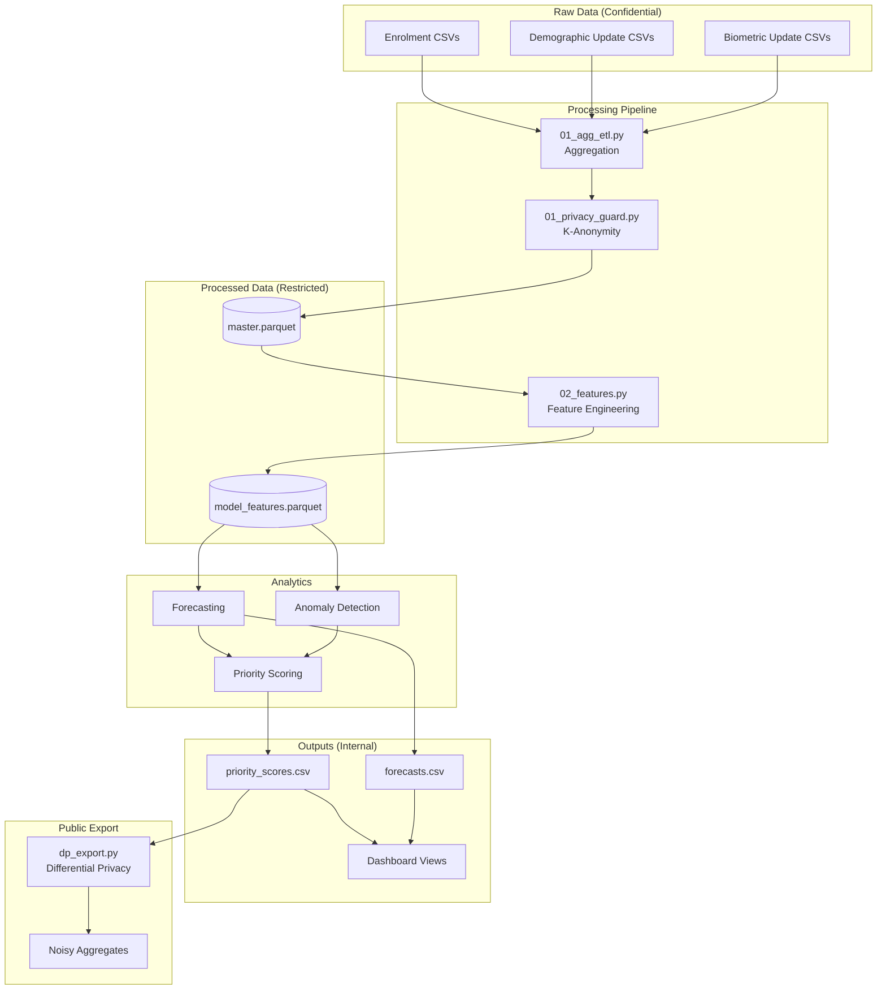

# Privacy Impact Assessment (PIA)
## Aadhaar Pulse - Child Update Intelligence Platform

**Document Version:** 1.0  
**Assessment Date:** 2026-01-10  
**Assessor:** Platform Development Team

---

## 1. Project Description

### 1.1 Overview

Aadhaar Pulse is an analytical platform designed to help UIDAI optimize child biometric update operations (ages 5-15) at the district level. The system provides:

- Demand forecasting for enrollment centers
- Bottleneck identification and prioritization
- Policy simulation for intervention planning
- Interactive dashboards for operational oversight

### 1.2 Data Processing Purpose

| Purpose | Lawful Basis |
|---------|--------------|
| Operational planning | Legitimate interest (public service efficiency) |
| Resource allocation | Performance of official duty |
| Trend analysis | Statistical purposes with safeguards |

---

## 2. Data Flow Diagram

---

## 3. Privacy Principles Compliance

| Principle | Implementation | Status |
|-----------|----------------|--------|
| **Data Minimization** | Only district-level aggregates stored; no individual records | ✅ |
| **Purpose Limitation** | Data used only for operational planning | ✅ |
| **Storage Limitation** | 90-day retention for raw, 1-year for processed | ✅ |
| **Accuracy** | Weekly refresh from official sources | ✅ |
| **Security** | Encrypted storage, RBAC, audit logging | ✅ |
| **Transparency** | This PIA document; data_governance.md | ✅ |

---

## 4. Risk Assessment

| Risk ID | Risk Description | Likelihood | Impact | Mitigation | Residual Risk |
|---------|------------------|------------|--------|------------|---------------|
| R1 | Re-identification from small cell counts | Medium | High | K-anonymity (k=10) suppression | Low |
| R2 | Unauthorized data access | Low | High | RBAC + audit logging | Low |
| R3 | Data breach during export | Medium | Medium | Differential privacy (ε=1.0) | Low |
| R4 | Inference attack on time series | Low | Medium | Aggregation to weekly level | Low |
| R5 | Insider misuse | Low | High | Audit logs + rotation policy | Low |

---

## 5. Technical Safeguards

### 5.1 K-Anonymity Implementation

- **Threshold:** k = 10
- **Method:** Values < k replaced with -1 (suppression marker)
- **Logging:** All suppressions logged to `suppression_log.csv`
- **Code:** `src/01_privacy_guard.py::apply_k_anonymity()`

### 5.2 Differential Privacy

- **Mechanism:** Laplace for counts, Gaussian for rates
- **Budget:** ε = 1.0 (conservative)
- **Application:** All public data exports
- **Code:** `src/dp_export.py`

### 5.3 Hashing

- **Algorithm:** SHA-256
- **Salt:** Cryptographic salt from secure storage
- **Rotation:** Annual salt rotation recommended

---

## 6. Data Subject Rights

| Right | Applicability | Implementation |
|-------|---------------|----------------|
| Access | Limited (aggregated data only) | Dashboard provides transparency |
| Rectification | N/A (derived from source systems) | Report to UIDAI directly |
| Erasure | Limited | Covered by retention policy |
| Portability | N/A | Aggregates not personal data |

---

## 7. Third-Party Sharing

| Recipient | Data Shared | Safeguards |
|-----------|-------------|------------|
| None currently | N/A | N/A |

*No third-party data sharing is implemented. Any future sharing requires amendment to this PIA.*

---

## 8. Sign-Off

| Role | Name | Date | Signature |
|------|------|------|-----------|
| Technical Lead | _________________ | __________ | __________ |
| Data Protection Officer | _________________ | __________ | __________ |
| Project Sponsor | _________________ | __________ | __________ |

---

## 9. Review Schedule

- **Next Review:** 2027-01-10
- **Trigger Events:** New data sources, new use cases, security incidents

---

*This Privacy Impact Assessment should be reviewed and updated whenever there are material changes to the data processing activities described herein.*
