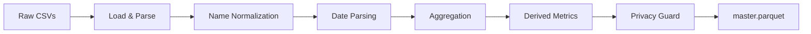
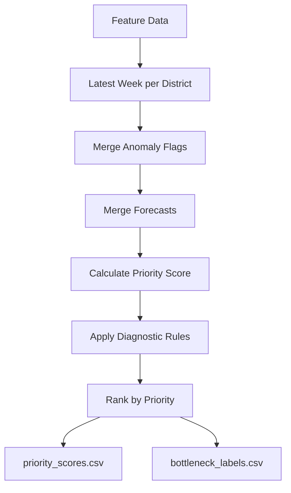
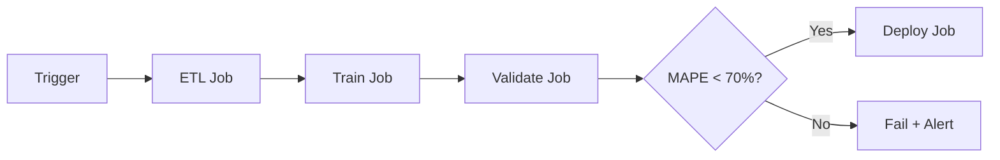

# Aadhaar Pulse - System Architecture Document

**Child Update Intelligence Platform**  
*Comprehensive Technical Reference*

---

## Executive Summary

Aadhaar Pulse is an end-to-end intelligence platform designed to optimize child biometric update operations across India's 1,100+ districts. It implements a **fusion-based diagnostic approach** combining demand forecasting, anomaly detection, bottleneck classification, policy simulation, and AI-powered insights.

### Key Technical Metrics

| Component | Metric | Target |
|-----------|--------|--------|
| Demand Forecasting | SMAPE | <70% |
| K-Anonymity | Threshold | k=10 |
| Monte Carlo Simulation | Runs per Scenario | 1,000 |
| Dashboard | Interactive Views | 8 tabs |
| Automated Tests | Pytest Coverage | 77 tests |

---

## High-Level Architecture

```
┌─────────────────────────────────────────────────────────────────────────────┐
│                              DATA SOURCES                                    │
├─────────────────────────────────────────────────────────────────────────────┤
│  📁 Enrolment CSVs    📁 Demographic CSVs    📁 Biometric CSVs              │
│      (Weekly)              (Weekly)               (Weekly)                   │
└──────────────┬──────────────────┬───────────────────┬───────────────────────┘
               │                  │                   │
               └──────────────────┼───────────────────┘
                                  ▼
┌─────────────────────────────────────────────────────────────────────────────┐
│                           ETL PIPELINE                                       │
├─────────────────────────────────────────────────────────────────────────────┤
│  agg_etl.py ──► privacy_guard.py ──► features.py                            │
│      │                │                    │                                 │
│  Aggregation     K-Anonymity         Feature Engineering                     │
│  District×Week   k=10 suppression    Lag, rolling, ratios                    │
└──────────────────────────┬──────────────────────────────────────────────────┘
                           ▼
┌─────────────────────────────────────────────────────────────────────────────┐
│                       PROCESSED DATA STORE                                   │
├─────────────────────────────────────────────────────────────────────────────┤
│  📊 data/processed/master.parquet                                            │
│  📊 data/processed/model_features.parquet                                    │
└──────────────────────────┬──────────────────────────────────────────────────┘
                           ▼
┌─────────────────────────────────────────────────────────────────────────────┐
│                          ML PIPELINE                                         │
├─────────────────────────────────────────────────────────────────────────────┤
│  forecast_lightgbm.py ──► anomaly_detection.py ──► bottleneck_fusion.py     │
│       │                        │                        │                    │
│  LightGBM Forecast       Isolation Forest +        5-Type Diagnosis          │
│  (Time-series CV)        Seasonal ESD             Priority Ranking           │
└──────────────────────────────┬──────────────────────────────────────────────┘
                               │
          ┌────────────────────┼────────────────────┬────────────────────┐
          ▼                    ▼                    ▼                    ▼
┌─────────────────┐  ┌─────────────────┐  ┌─────────────────┐  ┌─────────────────┐
│  📈 DASHBOARD   │  │  🔌 API         │  │  🤖 AI CHATBOT  │  │  📊 MONITORING  │
├─────────────────┤  ├─────────────────┤  ├─────────────────┤  ├─────────────────┤
│ Streamlit:8501  │  │ FastAPI:8000    │  │ Gemini 2.5 Flash│  │ Streamlit:8502  │
│ 8 Interactive   │  │ 6 Endpoints     │  │ NL Queries      │  │ PSI Drift       │
│ Tabs            │  │                 │  │ Context-Aware   │  │ MAPE Trends     │
└─────────────────┘  └─────────────────┘  └─────────────────┘  └─────────────────┘
```

---

## Component Architecture

### 1. Data Layer

#### Source Data Streams

| Dataset | Frequency | Key Fields | Purpose |
|---------|-----------|------------|---------|
| **Enrolment** | Weekly | date, state, district, age_0_5, age_5_17, age_18+ | New Aadhaar registrations |
| **Demographic** | Weekly | date, state, district, demo_age_5_17, demo_age_17_ | Address/name updates |
| **Biometric** | Weekly | date, state, district, bio_age_5_17, bio_age_17_ | Fingerprint/iris updates |

#### Canonical Schema (`master.parquet`)

| Column | Type | Description |
|--------|------|-------------|
| `state` | string | Indian state (normalized) |
| `district` | string | District name (normalized) |
| `year` | int | ISO calendar year |
| `week_number` | int | ISO week number (1-52) |
| `enroll_child` | int | Child enrolments (age 5-17) |
| `bio_update_child` | int | Child biometric updates |
| `demo_update_child` | int | Child demographic updates |
| `bio_demo_ratio_child` | float | bio_update / demo_update |
| `bio_demo_gap_child` | int | Backlog proxy (demo - bio) |

---

### 2. ETL Pipeline

**Source:** [agg_etl.py](file:///d:/Coding/UIDAI/code/src/agg_etl.py)



**Key Processing:**
- **Name normalization:** Historical district renaming (Bangalore → Bengaluru, Bombay → Mumbai)
- **Date parsing:** DD-MM-YYYY → ISO year/week extraction
- **Aggregation:** State-district-week grain

---

### 3. Privacy Framework

**Source:** [privacy_guard.py](file:///d:/Coding/UIDAI/code/src/privacy_guard.py)

| Protection | Implementation | Details |
|------------|----------------|---------|
| **K-Anonymity** | k=10 threshold | Counts <10 replaced with -1 |
| **Hashing** | SHA-256 | Salt from Streamlit secrets/env |
| **Audit Trail** | CSV logging | `data/inventory/suppression_log.csv` |
| **Differential Privacy** | Laplace noise (ε=1.0) | For external exports |

---

### 4. Feature Engineering

**Source:** [features.py](file:///d:/Coding/UIDAI/code/src/features.py)

#### Temporal Features
| Feature | Formula | Purpose |
|---------|---------|---------|
| `lag_1w_bio_update_child` | shift(1) | Previous week value |
| `rolling_4w_mean` | rolling(4).mean() | 4-week moving average |
| `wow_change` | current - lag_1w | Week-over-week delta |

#### Performance Features
| Feature | Formula | Purpose |
|---------|---------|---------|
| `completion_rate_child` | bio / demo (clipped 0-1) | Update completion ratio |
| `update_backlog_child` | demo - bio | Pending updates gap |
| `priority_score` | Weighted composite | Intervention ranking |

**Priority Score Formula:**
```
priority_score = 0.4×backlog + 0.3×(1-completion_rate) + 0.3×volume
```

---

### 5. ML Pipeline

#### Demand Forecasting

**Source:** [forecast_lightgbm.py](file:///d:/Coding/UIDAI/code/src/forecast_lightgbm.py)

| Aspect | Details |
|--------|---------|
| **Algorithm** | LightGBM (GBDT) |
| **Target** | bio_update_child |
| **CV Method** | Expanding window time-series (4 folds) |
| **Validation** | SMAPE <70% threshold |
| **Outputs** | yhat, yhat_lower (5%), yhat_upper (95%) |

**Feature Categories:**
- **Categorical:** state_encoded, district_encoded
- **Calendar:** week_sin/cos, is_school_break, month, quarter
- **Lags:** 1w, 2w, 3w, 4w bio/demo updates
- **Rolling:** 4w/8w/12w means, 4w std
- **Hierarchical:** state_bio_update, district_share

#### Anomaly Detection

**Source:** [anomaly_detection.py](file:///d:/Coding/UIDAI/code/src/anomaly_detection.py)

| Method | Purpose | Configuration |
|--------|---------|---------------|
| **Isolation Forest** | Multi-dimensional anomalies | contamination=0.05, n_estimators=100 |
| **Seasonal ESD** | Time-series anomalies | period=4 weeks, modified Z-score>3.5 |

---

### 6. Bottleneck Fusion Engine

**Source:** [bottleneck_fusion.py](file:///d:/Coding/UIDAI/code/src/bottleneck_fusion.py)

#### Five Diagnostic Categories

| Type | Key Triggers | Recommended Action |
|------|--------------|-------------------|
| **OPERATIONAL_BOTTLENECK** | Completion <70%, bio/demo <0.6 | Device upgrade, staff training |
| **DEMOGRAPHIC_SURGE** | Demand >50% above avg, healthy completion | Mobile camps, extended hours |
| **CAPACITY_STRAIN** | High saturation, declining trend | New centers, device upgrade |
| **INCLUSION_GAP** | Low saturation <30%, low activity | Awareness campaigns |
| **ANOMALY_DETECTED** | IF or S-H-ESD flags | Manual review |

**Fusion Pipeline:**


---

### 7. Policy Simulation

**Source:** [simulator.py](file:///d:/Coding/UIDAI/code/src/simulator.py)

#### Intervention Configurations

| Intervention | Cost (₹) | Capacity/Week | Duration |
|--------------|----------|---------------|----------|
| Mobile Camp | 150,000 | 1,000 | 4 weeks |
| Device Upgrade | 250,000 | 2,000 | 52 weeks |
| Staff Training | 75,000 | 500 | 8 weeks |
| Awareness Campaign | 50,000 | 300 | 6 weeks |
| Extended Hours | 100,000 | 800 | 12 weeks |

#### Monte Carlo Simulation
- **Runs:** 1,000 per district-intervention pair
- **Demand sampling:** Uniform(forecast_lower, forecast_upper)
- **Effectiveness scenarios:** Conservative (25%), Median (50%), Optimistic (25%)
- **Output:** 90% confidence intervals (p5, p50, p95)

---

### 8. AI Chatbot

**Source:** [chatbot.py](file:///d:/Coding/UIDAI/code/src/chatbot.py)

| Aspect | Details |
|--------|---------|
| **Provider** | Google Generative AI |
| **Model** | gemini-2.5-flash |
| **Context** | Priority rankings, bottleneck distribution, anomaly flags |
| **Capabilities** | Priority queries, forecast inquiries, intervention guidance |

---

### 9. Dashboard (Streamlit)

**Source:** [dashboard.py](file:///d:/Coding/UIDAI/code/app/dashboard.py)

| Tab | Purpose | Key Features |
|-----|---------|--------------|
| 📍 **Hotspot Map** | Geographic visualization | Choropleth heatmap, state summaries |
| 🔍 **District Analysis** | Single district deep-dive | SHAP explanations, impact estimates |
| 📊 **Compare Districts** | Side-by-side comparison | Radar charts, trend classification |
| 🎮 **Policy Simulator** | Intervention testing | Monte Carlo, 90% CIs, cost analysis |
| 📊 **Overview** | Summary metrics | Hero cards, bottleneck distribution |
| 📈 **Pilot Monitor** | A/B testing | Treatment vs. control tracking |
| 🔧 **System Health** | Operational monitoring | PSI drift, MAPE trends, alerts |
| 🤖 **AI Assistant** | Natural language interface | Context-aware Q&A |

**RBAC:**
- **Analyst:** Full access, raw data, simulations
- **Viewer:** Read-only, masked sensitive metrics

---

### 10. API Layer (FastAPI)

**Source:** [main.py](file:///d:/Coding/UIDAI/code/api/main.py)

| Method | Endpoint | Purpose |
|--------|----------|---------|
| GET | `/` | API info and available endpoints |
| GET | `/districts` | List districts with priority ranks |
| GET | `/interventions` | Available intervention configurations |
| GET | `/bottleneck/analyze/{state}/{district}` | Bottleneck analysis |
| GET | `/forecast/{state}/{district}` | Demand forecast with CIs |
| POST | `/recommend_action` | Intervention recommendations |
| POST | `/chat` | AI chatbot interaction |

---

## Infrastructure

### Docker Services

**Source:** [docker-compose.yml](file:///d:/Coding/UIDAI/code/docker-compose.yml)

| Service | Port | Purpose |
|---------|------|---------|
| `dashboard` | 8501 | Main Streamlit dashboard |
| `api` | 8000 | FastAPI recommendation service |
| `pilot-monitor` | 8502 | Pilot monitoring dashboard |
| `mlflow` | 5000 | Model versioning & tracking |

### CI/CD Pipeline

**Source:** [retrain.yml](file:///d:/Coding/UIDAI/code/.github/workflows/retrain.yml)



**Triggers:**
- Weekly cron: Sunday 00:00 UTC
- Push to `data/raw/**`, `src/features.py`, `src/forecast_lightgbm.py`
- Manual dispatch

**Quality Gates:**
- MAPE threshold: 70%
- Validation artifacts uploaded

---

## Testing

**Framework:** Pytest  
**Total Tests:** 77

| Test Module | Coverage |
|-------------|----------|
| [test_features.py](file:///d:/Coding/UIDAI/code/tests/test_features.py) | Feature engineering |
| [test_privacy_guard.py](file:///d:/Coding/UIDAI/code/tests/test_privacy_guard.py) | K-anonymity, hashing |
| [test_simulator.py](file:///d:/Coding/UIDAI/code/tests/test_simulator.py) | Monte Carlo simulation |
| [test_chatbot.py](file:///d:/Coding/UIDAI/code/tests/test_chatbot.py) | AI integration |
| [test_api.py](file:///d:/Coding/UIDAI/code/tests/test_api.py) | REST endpoints |
| [test_data_loader.py](file:///d:/Coding/UIDAI/code/tests/test_data_loader.py) | Data loading & schema |

---

## Data Flow Diagram

```
┌──────────────────────────────────────────────────────────────────────────────┐
│                            WEEKLY DATA INGESTION                              │
│  Enrolment CSVs ─┬─► agg_etl.py ─► privacy_guard.py ─► master.parquet        │
│  Demographic CSVs┤                                          │                 │
│  Biometric CSVs ─┘                                          ▼                 │
│                                                    features.py                │
│                                                         │                     │
│                                            model_features.parquet             │
└───────────────────────────────────────────────┬─────────────────────────────-┘
                                                │
          ┌─────────────────────────────────────┼───────────────────────────┐
          ▼                                     ▼                           ▼
    forecast_lightgbm.py              anomaly_detection.py          bottleneck_fusion.py
          │                                     │                           │
    forecasts_lgb.csv                    anomalies.csv              priority_scores.csv
                                                                    bottleneck_labels.csv
          └─────────────────────────────────────┼───────────────────────────┘
                                                │
                               ┌────────────────┼────────────────┐
                               ▼                ▼                ▼
                          simulator.py   action_recommender.py   fairness_audit.py
                               │                │                     │
                      sim_results/*.json  recommended_actions.json  fairness_report.csv
```

---

## Technology Stack

| Layer | Technology |
|-------|------------|
| **Data Processing** | pandas, numpy, Parquet |
| **Machine Learning** | LightGBM, scikit-learn |
| **Anomaly Detection** | Isolation Forest, statsmodels |
| **Privacy** | SHA-256, k-anonymity |
| **AI/NLP** | Google Gemini 2.5 Flash |
| **Dashboard** | Streamlit |
| **API** | FastAPI, Pydantic, Uvicorn |
| **MLOps** | MLflow, GitHub Actions |
| **Infrastructure** | Docker, docker-compose |
| **Testing** | Pytest |

---

## Security & Privacy Summary

| Aspect | Implementation |
|--------|----------------|
| **Data Aggregation** | Pre-aggregated at district-week level (no PII ingested) |
| **K-Anonymity** | k=10 suppression with audit logging |
| **Hashing** | SHA-256 with configurable salt |
| **Differential Privacy** | Laplace noise (ε=1.0) for exports |
| **Access Control** | RBAC (Analyst/Viewer roles) |
| **AI Safety** | Content filtering enabled |
| **Audit Trail** | Comprehensive logging of all access and suppressions |

---

*Document generated: January 2026*
